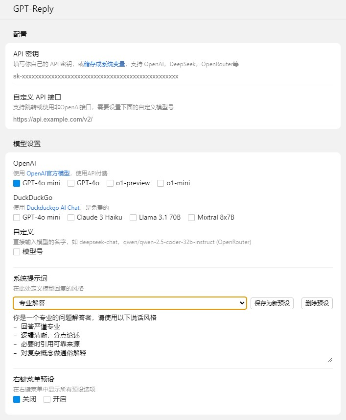
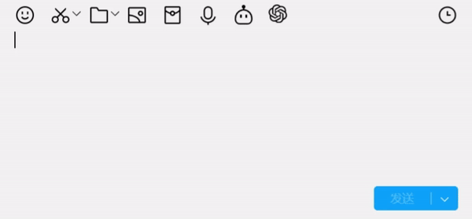

# LiteLoaderQQNT-GPT-Reply

[简体中文](./README.md) | English

The [LiteLoaderQQNT](https://github.com/LiteLoaderQQNT/LiteLoaderQQNT) plugin allows you to use ChatGPT to reply to messages directly in QQNT.

Currently features **right-click reply** and **in-message box text translation**.

Supports **custom system prompts** and **model number selection**.

Note: OpenAI GPT models are not free, usage will incur charges as per the official pricing.

## Feature Showcase

## Installation

Ensure you have LiteLoaderQQNT installed and functioning properly.

- Go to the [Release](https://github.com/wangyz1999/LiteLoaderQQNT-GPT-Reply/releases) section of this repository and download the latest plugin zip file.
- Extract the downloaded zip file from this repository's Release section into the LiteLoaderQQNT plugin directory.
- Start or restart QQNT.

## Usage Instructions

- Two methods to set the OpenAI API key. Numerous online tutorials available: [Official Tutorial](https://platform.openai.com/docs/quickstart/step-2-set-up-your-api-key)
  1. Set the system environment variable `OPENAI_API_KEY`. The API key in the settings can be left blank (recommended).
  2. Copy the API key into the plugin settings, then restart.
- Define how you want GPT to respond in the `System Prompt` settings.
- Right-click a message and select `GPT` to reply, or enter a prompt in the message box and click the GPT icon.

## Acknowledgements

- [LiteLoaderQQNT](https://github.com/LiteLoaderQQNT/LiteLoaderQQNT/)
- UI reference [LiteLoaderQQNT-DeepL](https://github.com/MUKAPP/LiteLoaderQQNT-DeepL/tree/main)